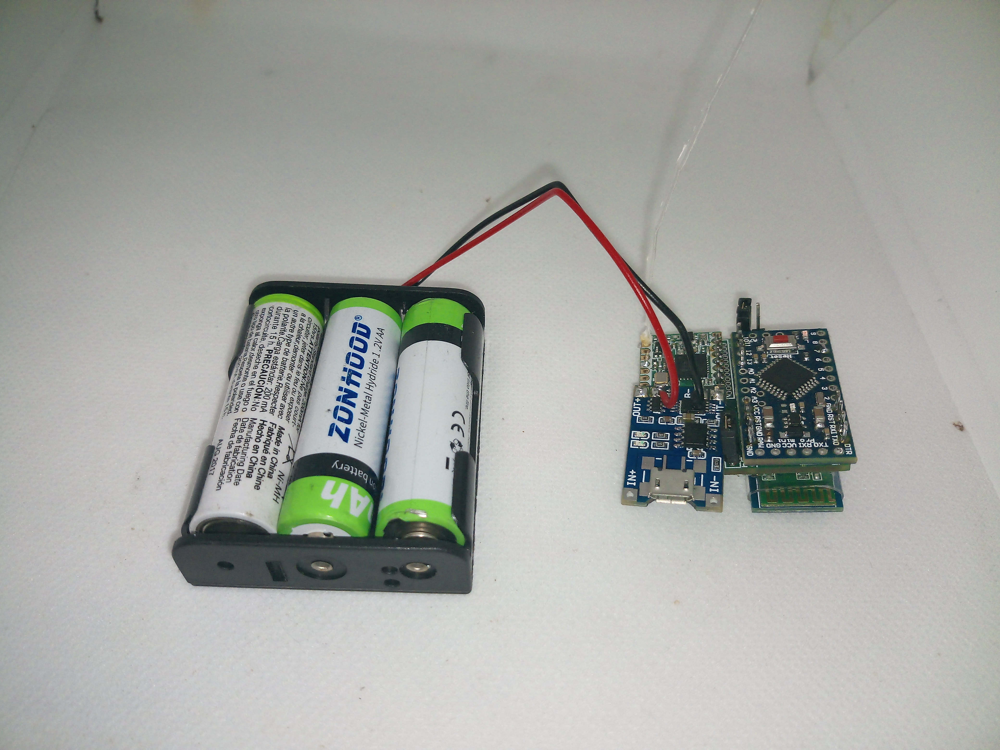

The Arduino Repeater Pylon is a low cost CellSol pylon designed for mass deployment. While it can only be accessed from a single other device using a Bluetooth
pairing, its main function is to forward messages along the network, extending the overall range for more complex pylons.

In the future, a repeater-router pylon may act as an upgrade for this model, allowing for multiple networks to interconnect.

