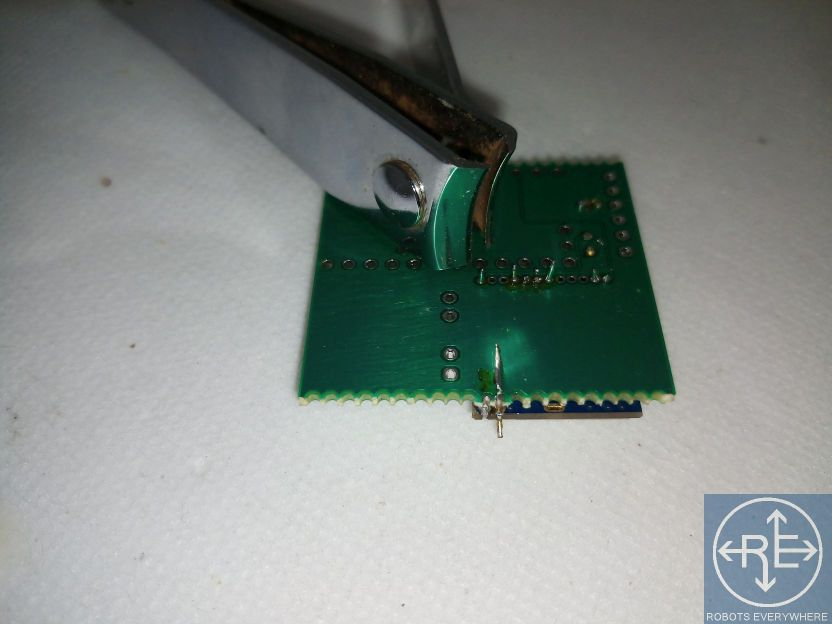
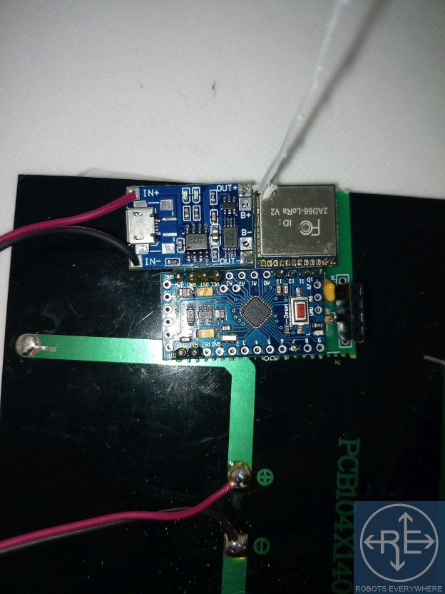

# Arduino Repeater Pylon Setup

Instructions by Kay Borri of Robots Everywhere. Many thanks.

These instructions assume you do not need help flashing the Arduino module using the [firmware](../firmware)

For instructions on what batteries and charging circuits can be added, look at [power supplies](../../power)

For more information refer to the [Schematic](../schematics) and [Bill of Materials](../bom)

## Soldering the Repeater Pylon

These instructions assume that you know how to solder. This project can be attempted by a beginner even though it has some small solder joints.

1) Here are your parts: wire, capacitor, resistor, board, LoRa module, Arduino, voltage regulator, battery charger circuit, headers.

2) First, put the capacitor and resistor in their spots on the circuit board, C1 and R1 respectively. They don't have a polarity.

3) This is what the top of the board should look like. Solder those two parts.

4) Cut the extra leads. You'll need it in a bit.

5) Populate the holes on the LoRa module using the leads, or some wire. If you don't want to do all of them, just do the ones in the picture.

6) Stick the LoRa module on top of the circuit board, then solder it in place.

7) Use the headers and the rest of the leads to prepare the battery charger circuit and the Arduino. Don't fill IN+ and IN- yet. Again, if you want to save header materials you can skip unused holes. 

8) A different angle showing what holes you have to populate. Your Arduino may look a bit different. Refer to your Arduino's datasheet.

9) Note where the voltage regulator goes. Also, note how the leads on the LoRa module were trimmed afterwards.

10) A toenail cutter is a good tool for this if you have nothing better, such as diagonal snips.

11) Solder the voltage regulator in place (its part number should be on top).

12) Solder the GND pin on the LoRa module to the circuit board, this will act as a rudimentary RF ground plane. If you can, you'll want to connect that to earth ground. Otherwise, use a dipole antenna.

12.5) The arduino node can have a dipole antenna by simply having one wire go up from the ANT pin, one wire go down from the GND pin next to it (they're 1mm apart to not interfere) and use a rigid piece of nonconductive material (plastic) to keep them opposite each other. Wires should be 85mm in length.

13) Insert the battery charger circuit, it should stick out a bit, then solder it.

14) This is what it should look like.

15) Drop the Arduino in, then solder it in place.

16) Time to make an antenna! You'll need a piece of wire. Strip the insulation for it at 82mm (or two if you are doing a dipole).

17) Put the antenna in the the ANT pin hole on the LoRa module up until the insulation, then cut the excess. (For a dipole, do the same with the second piece of wire and the GND pin, facing the other way)

18) This is what it should look like.

19) This is what it looks like from the bottom.

20) Solder the Bluetooth header on, and put the Bluetooth module in as shown. You can use a HC05 or HC06 or compatible. Note that the two outer pins are unused!

21) You can also skip the header and solder the Bluetooth module in place directly. Again note that STATE and EN are unused.

22) You'll have to figure out where you want the header.

23) Time to set up power! This is an old phone battery, a 4.5 to 6 volt solar panel, and some wire.

24) You'll need two +- cables. Strip their ends.

25) Find the + and - terminal on your solar panel. You can connect multiple panels to this IN PARALLEL.

26) Red to + and black to - for the panel(s). Nothing fancy here.

27) Connect those to the IN+ and IN- on the battery charger circuit. Note that you can still charge via USB as long as the panels aren't in direct sunlight when you do.

28) Solder the remaining cable to the battery. If you are recycling a phone battery, letting a solder blob form on the + and - pins will help. Ignore other pins. If you're using a new battery, just connect to that.

29) Unsurprisingly, the battery leads go to B+ and B- also note that this version does not have a power switch (you can add one at the battery). The next version will have a jumper for power.

30) This is what the complete unit looks like. You can flash the Arduino before installing it, or after.

