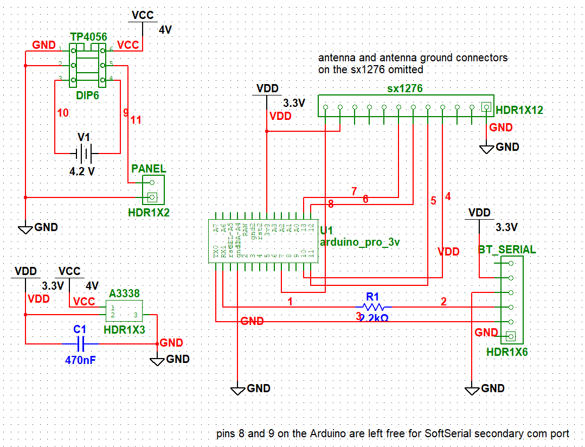

---
publishdate=2019-11-17
lastmod=2020-11-24
---

Full schematics and board layout files will be available on our GitHub page when the project is public.

 This work is licensed under a <a rel="license" href="http://creativecommons.org/licenses/by-nc-sa/4.0/">Creative Commons Attribution-NonCommercial-ShareAlike 4.0 International License</a>.

