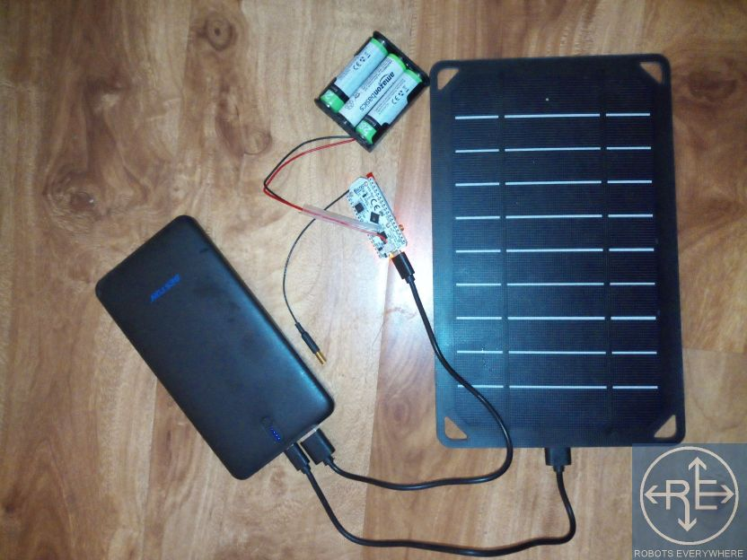

The ESP32 WiFi Pylon is an easy to assemble, WiFi capable CellSol pylon. It can be set up as its own WiFi access point, or connect to existing WiFi networks,
and serves a simple proof-of-concept chat app that broadcasts along the LoRa network.

It uses the Heltec Lora32 or Lora32V2 microcontroller board as its base.

