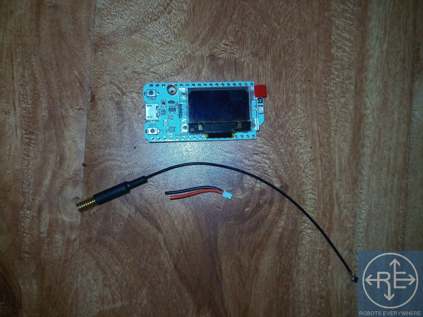
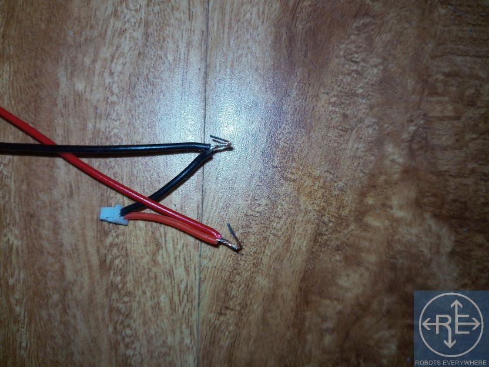

---
publishdate=2019-11-17
lastmod=2020-11-24
---

# CellSol ESP32 WiFi Pylon Setup

The WiFi pylon setup does not require soldering or any electronics expertise, though being able to solder the battery connection will improve the robustness of the device and make it more weatherproof.

For more detailed information refer to the [Schematic](../schematics) and [Bill of Materials](../bom)



## What You Will Need
* A Heltec Lora32 or Lora32v2 module
* The Arduino software, available [here](https://www.arduino.cc/en/Main/Software)
* A Micro USB cable for your Lora32
* Our CellSol ESP32 Pocket Pylon firmware, available on the [GitHub repository](https://github.com/RbtsEvrwhr-Riley/CellSol)
* 1.2V batteries (the bigger the better) OR, any 3.6 or 3.7 volt battery (li-ion, lipo, etc.) See [Powering the Node](power). If you're not sure, use 3 AA batteries.
* Battery holder for your chosen batteries (if necessary).
* Battery connector for the Lora32 module (should come with the Lora32)
* A 5V solar panel to charge the battery (optional, USB may also be used for charging with a 5V cell phone adapter or a computer)
* A case for your Lora32, antenna, and battery - see this website for [case designs](../case-designs)
* Some means of connecting wires together; soldering is ideal, but crimp connectors or a roll of tape will work in an emergency.

## References

Arduino: https://www.arduino.cc
Lora32: https://heltec.org/project/wifi-lora-32/

## Step 1: Setting Up the Arduino Software

### 1.1 Board Manager
To program your Lora32, you will need to have the board manager in the arduino software configured to support it. You will also need to install several arduino libraries used by our firmware.

You will need to add a URL to the Board Manager before starting. In the Arduino software, navigate to File -> Preferences... and in the dialog box, click the browse icon next to "Additional Board Manager URLs". In the text box that opens, add a new line, and enter the following URL:
[https://dl.espressif.com/dl/package_esp32_index.json](https://dl.espressif.com/dl/package_esp32_index.json)



Once this URL is added, you can go on and add the Lora32 boards using the Board Manager.

Navigate to Tools -> Board -> Boards Manager...

Enter "Heltec" in the search, and "Heltec ESP32 Series Dev-Boards" should appear. Click "Install" at the bottom right. Once installed, this button will be replaced by "Remove".



### 1.2 Libraries

With the boards configured, it is on to configuring the libraries. Navigate to Tools -> Manage Libraries...

A window similar to the Board Manager will open.



You will need to search for the following libraries, and, just like installing the boards in Board Manager, install them:
* Adafruit BusIO
* Adafruit GFX Library
* Adafruit SSD1306
* Heltec ESP32 Dev-Boards
* LoRa (by Sandeep Mistry)



## Step 2: Setting Up the Lora32 for Programming

With the Lora32 unplugged from your computer, navigate to Tools -> Port and look at the serial ports listed there.

Now, plug in your Lora32 using the USB cable. Your operating system should automatically detect it as a serial port, and configure that port. If it does not, refer to your operating system's documentation; but
it is most likely your Lora32 or your USB cable is defective. Try another one.

Navigate again to Tools -> Port. A new one should have appeared: this will be the serial port for the Lora32 you just plugged in. Click on it to select it for programming.

You also need to tell the arduino software that it is using a Lora32 or 32V2. Do this by again navigating to Tools -> Board -> Heltec ESP32 Arduino and selecting Lora32 (black board) or Lora32V2 (white board) depending on which one you are using.



The other settings for the Lora32 board can be left default; even if you are not in the EU, the REGION setting is not used by the firmware.

## Step 3: Configuring the Firmware

There are several firmware settings you will need to choose in order to get the performance you want out of your pocket pylons.

If you have not already done so, open the firmware's arduino project by File -> open, or using your system's file manager, and opening "esp32_wifi_bt.ino" that you downloaded at the beginning.

All of these options are configured in #define lines at the top of the root file "esp32_wifi_bt.ino"

Most of these options are turned on and off by commenting (making the line begin with //) or uncommenting (removing the //) the #define statements. The options you must set to make your pocket pylon work are explained below. The options not described are intended for developers, for more advanced configuration - you don't have to worry about them right now.

|Option Name|Purpose|Allowed Values|
|-----------|-------|--------------|
|WIFI_IS_CLIENT|Activates wifi gateway mode if uncommented. This connects the CellSol network to a wifi router.|None|
|WIFI_IS_HYBRID|Activates wifi hybrid mode if uncommented (gateway + AP). Takes priority over WIFI_IS_CLIENT.|None|
|DHCP|Uses DHCP for connecting to an upstream router (gateway or hybrid mode) if uncommented|None|
|REPEATER_ONLY|Emulates the Arduino repeater, turning off the wifi features entirely, if uncommented. Takes priority over everything.|None|
|CLIENT_IP_ADDR|Client IP address, with the numbers separated by commas; only used in IS_CLIENT or IS_HYBRID and only if DHCP is off.|An IP address separated by commas such as 192,168,1,55|
|GATEWAY_IP_ADDR|IP address of the gateway router, with the numbers separated by commas; only used in IS_CLIENT or IS_HYBRID and only if DCHP is off.|An IP address separated by commas such as 192,168,1,1|
|GATEWAY_SUBNET|Subnet mask for the gateway router, with the numbers separated by commas; only used in IS_CLIENT or IS_HYBRID and only if DCHP is off.|An IP subnet mask separated by commas such as 255,255,255,0|
|WIFI_UPSTREAM_AP|The access point name to be connected to if in IS_CLIENT or IS_HYBRID mode.|Network name in double quotes, like "RobotsEverywhere_24"|
|WIFI_UPSTREAM_PWD|The password to the access point to connect to in client or hybrid mode|Password in double quotes, like "derpderp"|

## Step 4: Assembling the Hardware

These instructions assume that you don't have any tools. If you have a soldering iron and wire cutters and better tape and/or heat shrink, you should clearly use them, but if you can do that, you don't really need these instructions...

1. This is what you need to assemble the full kit, in an emergency:
* ESP32 module with antenna
* Tape roll and/or double sided tape. Electrical tape or heatshrink tubing can be used to improve the build.
* USB solar panel
* Battery holder
* 1.2V batteries (the bigger the better) OR, any 3.6 or 3.7 volt battery (li-ion, lipo, etc.)

2. First thing first: check that the esp32 module is undamaged. Make sure the battery plug, USB port, and the screen are all there and attached. Make sure there are no deep cuts into the circuit board.

3. Connect the antenna - you'll have to carefully push down the U.FL connector. Make sure it is properly lined up - it takes a BIT of force, not a lot.

4. Strip the wires for the battery case. You can use the tape roll if you have nothing better. 1.5cm or half an inch is sufficient.

5. This should be your end result.

6. Do the same with the wires that came with the esp32 module.

7. This should be your end result.

8. You have to connect these red to red and black to black.

9. Twist the wires together, bending them backwards afterward. If you can solder, solder these wires together and skip steps 10 through 12.

10. Using the tape, cover one wire (Doing black here). Make sure you cover it fully. 

11. Using the tape, cover the other. Make sure you cover it fully. Leave some tape hanging.

12. Use the tape you left hanging earlier to wrap around your connection. It doesn't look pretty, but it will hold for a long time.

13. Now you can put the batteries in. Mind your polarity! Put the little connector in its socket on the bottom of the esp32 module.

14. Connect the USB solar panel to the USB connector on the esp32. You're done!

15. If you have a different battery, follow the same principle up until step 13 -- be sure to connect red to red and black to black.

16. If you have a USB powerbank, connect it between the ESP32 and the solar panel, via the USB port and USB cable. Solar panel goes to the charge port on the power bank.

## Step 5: Assembling the Power System

See [Powering the Node](../../power) for information on what batteries and charging equipment can be safely connected. As a general rule

## Step 6: Assemble the Case

See [Case Designs](../case-designs).